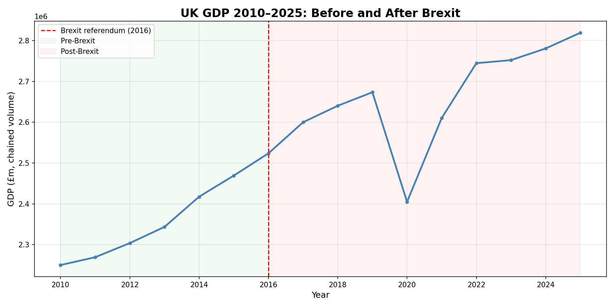
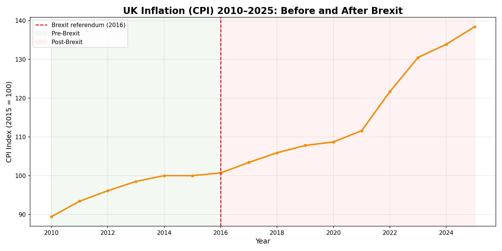
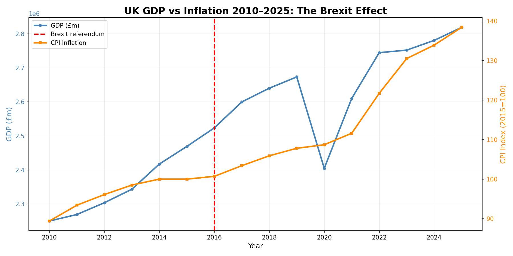

# UK Economic Analysis: The Brexit Effect

## Overview
This project analyses how Brexit impacted two key UK economic indicators — 
GDP and inflation — using official ONS data from 2010 to 2025.

## Key Findings
- UK GDP growth slowed significantly after the 2016 referendum
- Inflation remained stable pre-Brexit (CPI ~100) but surged to 138 by 2025
- The 2022-2023 inflation spike was the sharpest in the entire dataset

## Charts

### GDP 2010–2025

### Inflation 2010–2025

### GDP vs Inflation Combined

## Data Sources
- [ONS GDP Time Series](https://www.ons.gov.uk)
- [ONS Consumer Price Inflation](https://www.ons.gov.uk)

## Tools Used
- Python 3
- Pandas — data cleaning
- Matplotlib — visualisation
- Jupyter Notebook

## Project Structure
- data/ — raw and cleaned CSV files
- notebooks/ — Jupyter notebooks
- charts/ — saved visualisation images

## Author
Kimia Bahrololoomi — Economics Graduate
